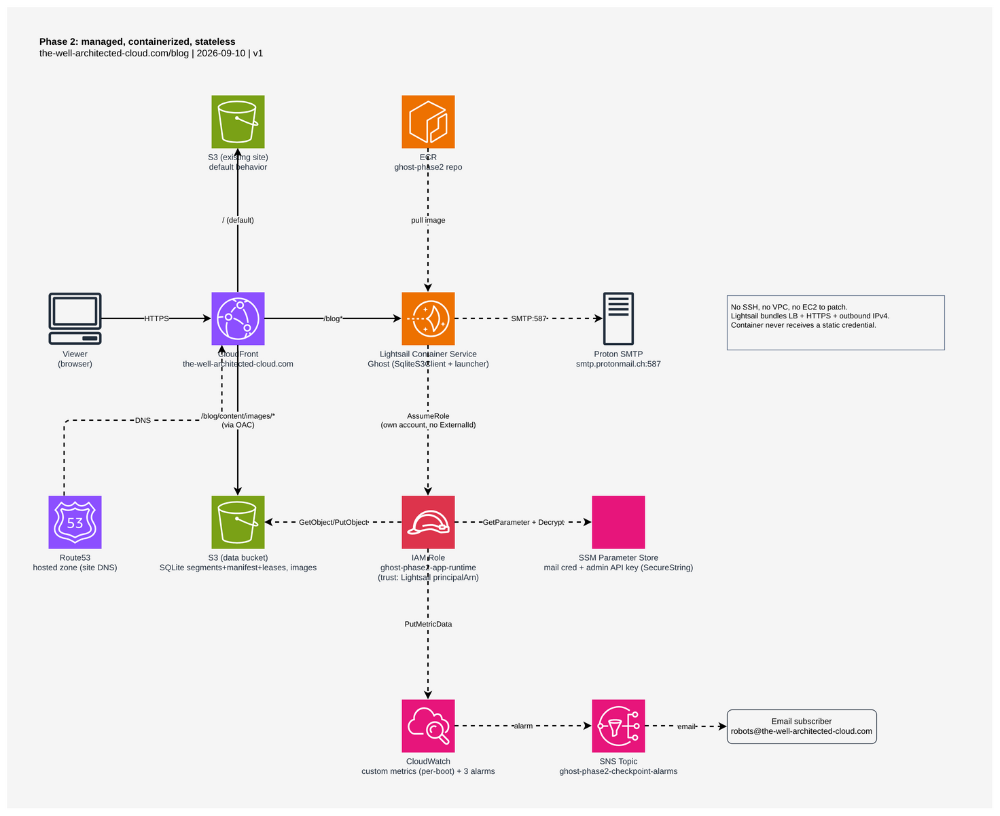

# Phase 2: managed, containerized, stateless

Goal: convert the Phase 1 VM-based Ghost install into a managed-container
setup without increasing cost, with nodes made stateless (filesystem and DB
externalized) so the deployment can scale beyond a single node later even
though it stays single-node for now. Also introduces OpenTofu as IaC and
reorganizes phase-specific scripts/docs into per-phase directories (this
directory; Phase 1's equivalent is `phase1/`).

## Architecture



(Editable source: `phase2.drawio`, built with the `aws-architecture-diagram`
skill — open it in [draw.io](https://app.diagrams.net/) to modify.)

```
viewer ──HTTPS──▶ CloudFront (the-well-architected-cloud.com)
                  ├─ default behavior ─────────▶ S3 (existing site)
                  ├─ /blog* ────────────────────▶ Lightsail Container Service ──SMTP:587──▶ Proton SMTP
                  │                                 │  (Ghost: SqliteS3Client + launcher)
                  │                                 │  ── AssumeRole (own account, no ExternalId) ──▶ IAM Role
                  │                                 │       (ghost-phase2-app-runtime)
                  │                                 │       ├─ GetObject/PutObject ──▶ S3 (data bucket)
                  │                                 │       ├─ GetParameter+Decrypt ──▶ SSM Parameter Store
                  │                                 │       └─ PutMetricData ──▶ CloudWatch ──alarm──▶ SNS ──▶ email
                  └─ /blog/content/images/* ───────▶ S3 (data bucket)   (segments+manifest+leases, images)
                                 (via CloudFront OAC + bucket policy)

Route53 (site DNS) ──▶ CloudFront                ECR (ghost-phase2 repo) ──pull image──▶ Lightsail Container Service
```

No SSH, no VPC, no EC2 to patch — the container platform is fully managed.
The container never receives a static credential of any kind; every AWS call
it makes goes through the `AssumeRole` hop described below.

## Design

- **Compute: Lightsail Containers** (Micro tier). Bundled load balancing +
  HTTPS, fully managed platform, no OS to patch.
- **DB: SQLite, backed by S3** via a Node.js reimplementation of an
  append-only-segments-plus-versioned-manifest design
  (`phase2/packages/sqlite-s3`), shipped as part of the Ghost launcher — not
  a managed DB service. **Resolved** (was an accepted, unresolved risk at
  design time): it does plug into Ghost's Knex/sqlite3 data layer — a custom
  `knex.Client` subclass (`SqliteS3Client`) intercepts commit/restore around
  a normal local SQLite file, so Ghost itself is unaware anything unusual is
  happening underneath. Confirmed by running in production since the
  cutover (2026-09-10). One real defect surfaced after cutover — a
  checkpoint/compaction race that let segments accumulate unboundedly under
  continuous writes — found and fixed (moth `zwx7x`), with boot-time
  CloudWatch metrics and alarms added afterward specifically to catch a
  recurrence early (moth `rk2qo`; see the Architecture diagram above).
- **Docker image**: fork `Ghost/` (already a submodule, reused from
  `qadpt`'s build pipeline), build a custom SQLite-capable image.
- **Image storage**: same S3 bucket as the S3-backed SQLite data.
- **Credential path** from the container into our AWS account:
  cross-account `AssumeRole`, no `ExternalId`. An IAM role in our account
  trusts the Lightsail container service's own `principalArn` (one per
  service, shared by every container/replica in it) as Principal — a live
  OpenTofu resource reference, never a hardcoded account ID or secret.
  Covers the SMTP-credential read (SSM), S3-backed-SQLite access (S3), and
  publishing boot-time monitoring metrics (CloudWatch) via one `AssumeRole`
  call at container startup. No static credential of any kind is baked into
  the image or deployment config.
- **Monitoring**: the container publishes its own CloudWatch metrics once
  per boot (orphaned-segment count, checkpoint-retry count, restore
  duration) rather than relying on Lightsail's limited built-in logs/metrics
  — three alarms notify by email on the specific failure modes the
  checkpoint fix above left as residual risk (moth `rk2qo`).
- **Migration/cutover from Phase 1**: one-time backup-and-restore, downtime
  accepted — no live-sync (see Decisions below for why). This was historical,
  one-time work, not part of Phase 2's ongoing architecture — full runbook:
  [`migration.md`](migration.md). Executed 2026-09-10.
- **IaC**: OpenTofu, versioned S3 remote state backend (see Deploying
  below), one file per main component (`s3.tf`, `lightsail.tf`, `iam.tf`,
  `cloudfront.tf`, `monitoring.tf`, etc.).

## Cost

**~$12-13/month, confirmed in production — lower than Phase 1's real total
of ~$15-19/mo** (see `phase1/readme.md`'s Cost estimate: EC2 $7.60 + EBS
$2.25 + Elastic IP $3.65 + CloudFront $1-5 + VPC-origin data processing
~$1). Phase 2 drops the EC2 instance, its EBS volume, and its Elastic IP
entirely (Lightsail needs none of them), and removes the VPC-origin data
processing charge (CloudFront now reaches Lightsail as a public HTTPS
origin, no VPC hop) — CloudFront's own request/data cost is unchanged
either way. At design time the total depended on whether the S3-backed
SQLite reimplementation would actually work (fallback: a managed DB,
pushing compute+storage+DB alone to ~$26/mo) — resolved, see Design above;
the managed-DB fallback was never needed.

(The Cost analysis table below instead baselines against Phase 1's
compute+storage figure alone, ~$8.24/mo — deliberately narrower, since
that comparison is choosing between compute *options* and holds
CloudFront/Route53/the Elastic IP out of scope on both sides rather than
comparing full totals.)

| Item | Monthly estimate | Notes |
|---|---|---|
| Lightsail Container Service (Micro) | ~$10.00 | Bundled load balancing + HTTPS included, no separate LB charge |
| S3 (data bucket: SQLite store + images) | ~$1-2 | Storage + requests at ~2GB content; confirmed live content is 15MB/76 files, well under this |
| ECR (private image registry) | ~$0.10-0.20 | One image kept at a time; storage-only cost |
| CloudWatch (3 custom metrics + 3 alarms) | ~$1.20 | 3 metrics × $0.30/mo + 3 alarms × $0.10/mo (moth `rk2qo`) |
| SNS (alarm email topic) | ~$0 | Well under the 1,000 free email notifications/month |
| CloudFront (existing distribution, extended) | (pre-existing, not incremental) | Same distribution already serving Phase 1; `/blog*` and image behaviors added, no new distribution |
| Route53 hosted zone | (pre-existing, not incremental) | Already existed before Phase 1 |
| **Total (new, incremental)** | **~$12-13/month** | |

## Cost analysis

Compute + storage + DB only in the comparison below — CloudFront, Route53,
and mail are unchanged by this phase and are excluded, matching the Cost
table's own "pre-existing, not incremental" rows. Content+DB size assumed
~2GB (personal blog, low image volume; confirmed live content is 15MB/76
files, well under this).

Baseline (Phase 1, current): t3.micro on-demand ~$7.60/mo + 8GB gp3 EBS
~$0.64/mo ≈ **$8.24/mo**.

| Option | Compute | Storage | DB | Total/mo | Fit |
|---|---|---|---|---|---|
| **ECS on EC2** (not chosen) | t3.micro $7.60 (same box, repurposed as ECS container instance) | EBS $0.64 + EFS (2GB, One Zone) $0.32 | $0 — SQLite file lives on EFS, single writer (one Ghost task) | **~$8.56** | Cheapest option, no LB needed, no forced DB service — because the instance keeps a stable private IP CloudFront's VPC origin can target directly |
| **Fargate** (rejected) | 0.25 vCPU / 0.5GB: $8.99, **plus an NLB, ~$16.50/mo** — required because a Fargate task has no fixed IP, and CloudFront's VPC origin needs one | EFS (2GB) $0.32 | $0 — SQLite-on-EFS | **~$25.81** | The NLB erases essentially all of Fargate's cost advantage |
| **Lightsail Containers** (chosen) | Micro $10/mo — bundled load balancing + HTTPS included, no separate LB charge | none — Lightsail containers categorically cannot attach a disk or EFS (confirmed platform limit); ephemeral 20GiB/node only | S3-backed SQLite (reimplemented), not a managed DB service | **~$11-12/mo** (compute $10 + ~$1-2 S3 for DB+images) — see the Cost table above for the full ~$12-13/mo including ECR/CloudWatch/SNS | No VPC-private origin — accepted tradeoff, see Decisions |
| **Fargate + RDS MySQL** (reference only) | ~$8.99 | EFS (2GB) $0.32 | RDS `db.t4g.micro`, single-AZ, on-demand: $11.68 compute + $2.30 storage (20GB minimum) ≈ $13.98 | **~$23.29** | Real shared, multi-writer-capable DB — not needed at single-node scale |

Cheapest viable RDS floor (for reference, not chosen): the `~$23.29/mo`
row above is already the floor for a real single-AZ RDS instance —
`db.t4g.micro` (Graviton) is the cheapest current-generation class, 20GB
is RDS's minimum allocated storage for MySQL, single-AZ/no read
replica/no enhanced monitoring already assumed. A 1-year no-upfront
Reserved Instance would cut it to ~$20.08/mo (a standing commitment);
RDS Free Tier could drop it further for the first 12 months, per AWS's
standard free-tier terms. Aurora Serverless v2's minimum (~$43.80/mo) is
*more* expensive than provisioned `db.t4g.micro`, not a path to a lower
floor.

Sources: [AWS Fargate pricing](https://aws.amazon.com/fargate/pricing/),
[AWS Lightsail pricing](https://aws.amazon.com/lightsail/pricing),
[AWS EFS pricing](https://aws.amazon.com/efs/pricing/),
[AWS RDS for MySQL pricing](https://aws.amazon.com/rds/mysql/pricing/).

## Deploying

One command, run manually (no CI/cron trigger): `phase2/scripts/deploy.sh`,
from the repo root, with real AWS credentials for the account that owns
`phase2/iac/`'s resources. On a fresh checkout, initialize the IaC
directory first — state lives in a versioned S3 bucket, wired through a
partial backend config: `cd phase2/iac && tofu init -backend-config=backend.hcl`
(that file is gitignored because the bucket name embeds the account ID;
recreate it from `.local-secrets.md`). `phase2/iac/phase1.auto.tfvars` must
also exist — every `tofu` invocation in `phase2/iac/` (including this
script's own `tofu apply` and `build.sh`'s `tofu output`) fails outright
without it; see `.local-secrets.md` under "Phase 2 CloudFront import (moth
i8hlt)" for the values, and [`migration.md`](migration.md)'s step 0 for how
it's built. It builds & pushes a new image (git short-SHA
tag), applies it via OpenTofu, then independently verifies the live
deployment (an HTTP smoke test, a Ghost Admin API create/read/delete
roundtrip that exercises the real SQLite-over-S3 write path, and an HTTP
fetch of the uploaded image's real public URL through the CDN — this last
check exists specifically because a bucket-policy regression once broke
every image on the site while the roundtrip alone kept reporting success,
see moth `i8hlt`) — see
`docs/superpowers/specs/2026-09-08-phase2-deploy-observability-design.md`
for why a second, independent check is needed on top of Lightsail's own
health check, and the full failure-mode/rollback design.

**Outcomes:**
- Both `tofu apply` and verification succeed: the new tag is live, script
  exits 0.
- `tofu apply` itself fails: the previous deployment is untouched and still
  serving; script reports and exits non-zero, no rollback needed. (This
  covers both Lightsail rejecting the new version, and any other resource
  in the same apply failing — check `aws lightsail get-container-service-deployments`
  for whether a new version actually went `ACTIVE` despite the reported
  failure, since these are reported the same way but aren't the same thing.)
- `tofu apply` succeeds but verification fails: script looks up the
  previous deployment's tag from Lightsail's own history and redeploys it,
  then exits non-zero reporting which tag ended up live.
- First-ever deploy with no previous tag to fall back to, or a rollback
  attempt that itself fails: script exits non-zero with an explicit
  message — never guesses further, never auto-retries.

**One-time setup, before the first deploy verification can pass:** a
dedicated Ghost Admin API "Custom Integration" must be created manually
through the live admin panel, and its `id:secret` stored as an SSM
SecureString named `ghost_phase2_admin_api_key` (same pattern as the
mail credential) — `deploy.sh` reads it with its own AWS identity, the
container itself never receives it. See the design doc's "Admin API key
provisioning" section for detail.

**Not automated by this script:** mail delivery is not verified per-deploy
(accepted gap, see design doc). The one-time Phase 1→2 migration/cutover is
entirely separate, already-completed work — see [`migration.md`](migration.md).

## Upgrade process (new Ghost versions)

This is about pulling in a new upstream Ghost release over time — not the
Phase 1→2 migration (see [`migration.md`](migration.md) for that one-time
move). Manual trigger only, no CI/cron (moth `tcho2` tracks turning this
into a scheduled/automated pipeline later).

1. **Sync + test**: `scripts/sync-ghost.sh` (repo root). Fast-forwards the
   `Ghost/` submodule's `main` onto `upstream/main` (`TryGhost/Ghost`) and
   pushes it to the fork's `origin`; merges `main` into `fork_main` (where
   the sqlite-s3 integration actually gets exercised — `main` itself stays
   a pure, unmodified mirror) and pushes that too; runs `sqlite-s3`'s own
   e2e Cucumber suite (real S3, multi-writer reconciliation, fully
   automated, manages its own throwaway bucket); then runs the `sqlite-s3`
   smoke test against `fork_main`. The smoke test has a manual "create a
   post" gate, so this step only completes when run attended — it fails
   outright (by design, not a bug) if AWS credentials are missing or the
   run is unattended. Idempotent: safe to re-run for either trigger (new
   upstream Ghost commits, or a new `sqlite-s3` commit in this repo).
2. **Pin what actually deploys**: `phase2/docker/build.sh` builds the image
   from whatever commit `Ghost/` is *currently checked out to* — not
   automatically the `fork_main` tip step 1 just advanced (recall from
   `migration.md`: the submodule pointer, not this outer repo's own commit,
   determines the deployed Ghost version). Once you're satisfied with a
   synced `fork_main`, check out the exact commit or tag you want to ship
   and commit the updated submodule pointer:
   ```bash
   cd Ghost && git checkout <tag or commit on fork_main> && cd ..
   git add Ghost && git commit -m "Ghost: bump to <version>"
   ```
3. **Deploy**: `phase2/scripts/deploy.sh` (see Deploying above) builds from
   that pinned commit, applies it, and independently verifies the live
   deployment before it's considered done — same pipeline, same rollback
   behavior as any other deploy.

Unlike the one-time migration (which required landing on a Ghost that runs
**no** schema migrations on boot, so the source/target database comparison
stayed meaningful), a routine upgrade lets Ghost run its own DB migrations
on boot as normal — there's no parallel "old" database here to diff
against.

`@ghost-phase2/sqlite-s3` is a plain `file:` dependency of the launcher
package (`phase2/packages/ghost-sqlite-s3-launcher/package.json`) — both
packages live in this same repo checkout, so it always reflects whatever's
currently in `phase2/packages/sqlite-s3`. No separate pin to update, and
nothing about a `sqlite-s3` change requires touching the `Ghost/` submodule
or vice versa.

## Decisions and rejected alternatives

- **Compute: Lightsail Containers**, not Fargate or ECS-on-EC2/plain
  Docker. Fargate's apparent cost parity with ECS-on-EC2 depended on
  skipping the load-balancer requirement (a Fargate task has no fixed IP,
  and CloudFront's VPC origin needs one) — accounting for the ~$16.50/mo
  NLB that requires erases the advantage. ECS-on-EC2/plain-Docker would
  have been cheaper (no LB or managed-DB cost forced, since a stable EC2
  private IP is something CloudFront's VPC origin can target directly),
  but Lightsail's bundled load-balancing/HTTPS and fully managed platform
  were preferred anyway.
- **Lightsail's public-endpoint (non-VPC-private) posture: accepted.**
  Phase 1's "no public inbound except via CloudFront" principle exists to
  reduce a long-lived EC2 instance's attack surface, which doesn't apply
  the same way to a managed container platform with no OS to patch.
- **DB: S3-backed SQLite reimplemented in Node.js**, not adopting the
  third-party [chrisk60331/distributed-sqllite](https://github.com/chrisk60331/distributed-sqllite)
  repo directly (reimplementing instead so it integrates with Ghost's
  actual data layer), and not RDS or Lightsail's managed DB (~$14-26/mo)
  — Lightsail has no persistent-volume option at all, and the minimum
  that works was preferred over paying for a full managed DB. This was an
  accepted, unresolved risk at design time (see Design above); it resolved
  in production's favor, and the managed-DB fallback was never exercised.
- **Credential path: cross-account `AssumeRole`, no `ExternalId`.**
  Rejected baking a static IAM access key into the image/deployment env
  (real secrets-hygiene risk — visible in deployment history). Rejected
  granting the container's ambient default identity direct resource
  access (a Lightsail bucket grant, or a plain S3 bucket policy) instead
  of an `AssumeRole` hop — both denied by AWS; that shared execution role
  is scoped to essentially just `sts:AssumeRole`, confirming the role hop
  is the sanctioned path, not a workaround. Rejected an `sts:ExternalId`
  condition on the trust policy — only earns its keep when trusting a
  whole account root; the per-service `principalArn` is already unique
  and is the access boundary by itself.
- **Docker image: fork, not upstream's compose packaging.** Moot to debate
  whether upstream nominally supports SQLite via config, since it's a
  custom fork build either way.
- **Migration: one-time backup-and-restore, not live-sync.** Not needed
  for a personal blog at this scale.
- **Monitoring: custom CloudWatch metrics published from the container's
  own runtime identity, not Lightsail's built-in logs/metrics.** The
  built-in surface is too limited to catch a slow-accumulating regression
  (the original checkpoint leak took 16 hours of continuous uptime with no
  restart to surface). Metrics publish once per boot rather than
  continuously, to keep cost/API-call volume down; the accepted gap this
  creates (a leak during a very long uptime with no restart) is mitigated
  by a separate, unrelated weekly auto-update restart (moth `tcho2`).
  Rejected: a recurring in-process timer independent of boot — closes the
  gap more completely but adds always-on complexity not judged worth it
  given the restart cadence already planned.

## Discussion: RAM investigation

Live investigation (SSM into the running instance, 2026-09-07) found
Ghost itself uses ~230MB resident (peak 318MB, plus it actively swaps —
603MB of the 1GB swap file in use at check time). The RAM pressure
driving the need for a 1GB swap file is mostly *not* Ghost — it's Ubuntu
server's baseline daemon set stacked alongside it (`systemd-journald`
111MB, `fwupd` 31MB, `snapd` 23MB, SSM agent workers ~35MB, plus
ModemManager/multipathd/udisksd/chronyd/rsyslogd/polkitd). None of that
exists inside a container, so a containerized Ghost's real requirement is
closer to 0.5GB than 1GB — this is what let Fargate's compute estimate
come down from an initial 0.5GB/1GB guess to 0.25 vCPU/0.5GB.

## Discussion: networking (mostly superseded by the Lightsail choice)

This investigation assumed a VPC-based compute option (ECS-on-EC2 or
Fargate) and predates the Lightsail decision. Lightsail Containers don't
use ECR pulls or EFS mounts the way this section describes. Kept for the
record since it may become relevant again if Lightsail's S3-backed-SQLite
approach doesn't pan out and the fallback reopens ECS-on-EC2/Fargate.

Investigated whether ECR image pulls and EFS mounts support IPv6, since
Proton SMTP (like SES) is IPv4-only and Phase 1's Elastic IP exists solely
to serve that one dependency:

- **ECR**: dual-stack endpoints (API + Docker/OCI pull) support IPv6 at no
  extra cost; PrivateLink-over-IPv6 into a VPC was a gap until Nov 2025,
  now resolved. ([release notes](https://aws.amazon.com/about-aws/whats-new/2025/11/ecr-dual-stack-endpoints-privatelink))
- **EFS**: mount targets can be IPv4, dual-stack, or IPv6-only per subnet;
  needs `amazon-efs-utils` ≥ 2.3 on the client for IPv6 mounting.
  ([announcement](https://aws.amazon.com/about-aws/whats-new/2025/06/amazon-efs-internet-protocol-version-6))

So the likely setup, same shape for either compute option: a **dual-stack
subnet**, IPv6 for ECR pulls and EFS mounts, IPv4 kept only for the one
thing that needs it (Proton SMTP) — no NAT gateway in either case, matching
Phase 1's existing "no NAT, Elastic IP covers the one IPv4-only dependency"
pattern:

- **ECS on EC2**: no change needed — same instance, same Elastic IP + IGW
  route already serving Proton. Add IPv6 to the subnet/ENI for ECR/EFS
  traffic. Zero new cost.
- **Fargate**: task's ENI (awsvpc mode) needs a public IPv4 in a public
  subnet with an IGW route (`assignPublicIp=ENABLED`, or an EIP) for the
  Proton SMTP leg only — direct IGW egress, not NAT. ECR pulls and the EFS
  mount use IPv6 on the same dual-stack subnet. The public IPv4 hourly
  charge (~$3.60/mo since AWS's 2024 pricing change) already applies to
  Phase 1's Elastic IP today, so this isn't a new cost line vs baseline.

For Lightsail specifically: outbound IPv4 was confirmed working with zero
setup in the hands-on test below. How the container reaches Proton is
otherwise unresearched beyond that.

## Discussion: Ghost's own Docker packaging (reference, not adopted as-is)

`docs.ghost.org/install/docker` and `github.com/TryGhost/ghost-docker` both
target **docker-compose**, not ECS/Fargate/Lightsail directly, and assume
**MySQL** (no SQLite in that packaging) plus Caddy for TLS termination and
optional Tinybird for analytics. Translating to any of the compute options
above would have meant: compose env vars → task-definition/container env
vars, the bind-mounted content volume → an EFS mount, and dropping Caddy
entirely (CloudFront already terminates TLS at the edge). Moot now that
the Docker image is a custom fork build regardless.

## Discussion: hands-on Lightsail tests (2026-09-07)

Created and destroyed several real, throwaway Lightsail resources
(container services, buckets, IAM roles) to validate the design rather
than guess:

**Outbound IPv4**: confirmed working with zero setup. A test container
reached `checkip.amazonaws.com` over IPv4 and got a real public address
back — no NAT/VPC config needed.

**Credential path — three iterations**:

1. First, confirmed Lightsail containers run on Fargate under the hood
   (`AWS_EXECUTION_ENV=AWS_ECS_FARGATE`) and get auto-injected credentials
   via `AWS_CONTAINER_CREDENTIALS_RELATIVE_URI`, but the assumed role
   lives in an **AWS-managed backend account** (confirmed via
   `sts get-caller-identity`: a distinct AWS-owned account, not this
   project's own account) with zero permissions to our resources by default
   (`ssm:GetParameter` → `AccessDeniedException`). The resource-access
   route was tried too — Lightsail buckets can be granted to Lightsail
   **instances**, but `set-resource-access-for-bucket` explicitly rejects
   container services. The only documented credential path for container
   services is the ECR-image-puller role, scoped to pulling private
   images only.
2. Tested the confused-deputy pattern: an IAM role in our own account,
   trust policy naming the container service's `principalArn` as
   Principal plus an `sts:ExternalId` condition, `ssm:GetParameter`
   granted, container calls `sts.assume_role(RoleArn=...,
   ExternalId=...)` using its auto-injected default credentials. **It
   worked** — real parameter value came back.
3. Tried to remove the `ExternalId` requirement by testing whether the
   ambient default identity could instead read directly from a resource
   grant (a Lightsail bucket's access grant, then a plain S3 bucket
   policy naming the `principalArn` directly, no `AssumeRole` hop at
   all) — **both denied**, the S3 bucket policy attempt with a generic
   `AccessDenied` (no policy-detail message, unlike the earlier SSM
   denial) — consistent with AWS deliberately scoping that shared
   execution role down to essentially just `sts:AssumeRole`. Also
   confirmed `principalArn` is one-per-*service* (not per-container or
   per-scaled-node — every container and every replica in one Lightsail
   container service shares the same `principalArn`), which is already
   unique enough to be the access boundary without `ExternalId`.

All test resources (container services, buckets, bucket access keys, IAM
roles, SSM parameters) were deleted after each test. One classifier
incident along the way: an early test tried baking a Lightsail bucket
access key directly into a deployment's environment variables to check
whether that could sidestep `AssumeRole` entirely — blocked by the
permission classifier (secret-in-deployment pattern), which is
functionally the same objection as the "don't bake static credentials
into the image" decision above, arrived at independently by the
classifier before the design decision was finalized.
